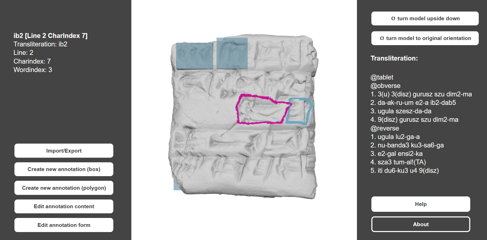
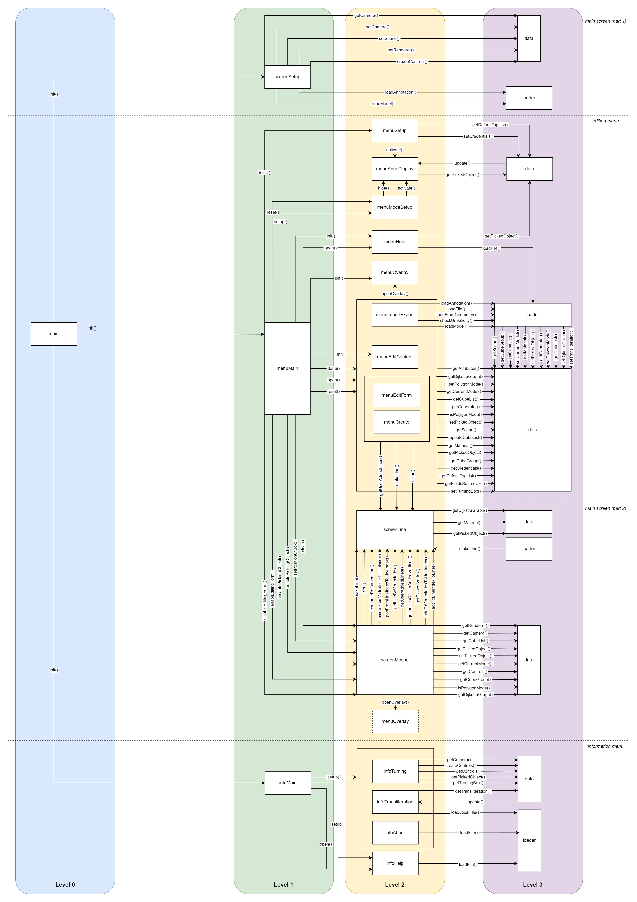

# Cuan3D

Cuan3D is a prototype of a web application for annotating cuneiform signs on 3D models. It is possible to load 3D models of cuneiform tablets from *.ply* files, load annotations from *JSON* files, change the content and/or form of existing annotations, create new ones and/or export annotations as *JSON* files. Annotations can either be shown and drawn as boxes or polygons.

Link to the application: https://vegarylis.github.io/cuan3d

Link to the manual: https://vegarylis.github.io/cuan3d-manual



The prototype was developed as part of a project in the study programme "Digital Methods in the Humanities and Cultural Studies" at Mainz University of Applied Sciences and Johannes Gutenberg University. The project took place over a period of three month in winter 2024. It was attached to the project ["Digital editing of the cuneiform texts from Haft Tappeh"](https://i3mainz.hs-mainz.de/en/projekte/hafttappeh/) of i3mainz, a research institute at Mainz University of Applied Sciences. 

Since the prototype was developed as part of a now concluded project, it will not be developed further. Bugs will not be fixed.

## Installation

Cuan3D was built with *Node.js*. To further develop the project, you need to have *Node.js* installed on your computer.

To recreate the directory `node_modules` run the following command in the project directory to install all dependencies listed in `package.json`:
```bash
npm install
```

To start the application on your local computer run the following command in the project directory:
```bash
npm run dev
```
and open http://localhost:5173/ in your browser.

## Project status
Known bugs:
* Some shortcuts for turning the model don't work in some circumstances

Features that might be useful but were not implemented:
* Import other 3D model file formats than *.ply* files (e.g. *nxs* files)
* Manually change position of the light source and shadow intensity 
* Export only a subset of annotations
* Export the part of a 3D model containing a specific annotation
* Scale box annotations with mouse
* Fill inner part of polygon annotations with color

## Project structure
Cuan3D is made up of different *.js* scripts implementing different functionalities. This is an overview of them to make future development and maintainability easier. Dependencies between the scripts can be found below.

**main.js**\
Starting point of the application.

**screenSetup.js**\
Setup of *three.js* components (scene, camera, renderer etc.); handles animation loop and window resizing.

**screenMouse.js**\
Handles mouse functionality (enabling/disabling functionality, selecting annotations, selecting vertices on the mesh or on polygon annotations, setting initial position of box annotations); in addition: handles keyboard inputs to undo steps from polygon creation and automatic closing of polygon annotations.

**screenLine.js**\
Finds the closest vertex on the mesh of a model to a selected point on the mesh; computes the shortest path between two vertices on the mesh; creates lines for polygon annotations.

**polygonCreateClasses.js**\
Classes for a graph representing the mesh of the model; the graph is used to find the shortest path in *screenLine.js*.

**menuMain.js**\
Management of the *editing menu* on the left side of the screen. Handles visibility of *HTML* elements on the screen, changing between modes (e.g. Import/Export) and en-/disabling mouse functionality in different contexts (e.g. disabling selection of annotations if one is being edited). It's the interface between the scripts for specific functionalities of the *editing menu* (scripts starting with *menu*) and other classes initiating those functionalities.

**menuSetup.js**\
Setup and management of user identifaction when application is started; setup of default tags for *Edit content mode*.

**menuAnnoDisplay.js**\
Activates, updates and hides display of annotation content on the *editing menu* whenever necessary. 

**menuModeSetup.js**\
Setups and resets *HTML* elements needed for the specific modes (e.g. *Import/Export mode*).

**menuImportExport.js**\
Management of *Import/Export mode*. Handles import and export of models of cuneiform tablets, annotations and transliterations.

**menuCreate.js**\
Management of *Create annotation mode*. Handles creating box and polygon annotations and adds *JSON* structure for the export of annotations. 

**menuEditContent.js**\
Management of *Edit annotation content mode*. Handles form and tag inputs for the content of an annotation and their deletion.

**menuEditForm.js**\
Management of *Edit annotation form mode*. Handles GUI setup for changing the form of box annotations, deleting annotations and computing the WKT-String from the geometry of an annotation.

**menuHelp.js**\
Management of *help* information for the specific modes in the *edit menu*.

**menuOverlay.js**\
Management of screen overlay (e.g. ask the user if a polygon annotations should be closed by the application).

**infoMain.js**\
Management of the *information menu* on the right side of the screen. Sets up functionality for turning the model of the cuneiform tablet with the two buttons at the top of the menu and displaying *Help* information. Handles changing between displaying transliteration and *About* information. It's the interface for the scripts implementing various functionalities for the menu (scripts starting with *info*). 

**infoTurning.js**\
Handles rotation of camera and box annotations, both by the buttons in the *information menu* or by keyboard shortcuts.

**infoTransliteration.js**\
Handles setting up and updating transliteration on the *information menu*.

**infoHelp.js**\
Management of main *help* information displayed on the *information menu*.

**infoAbout.js**\
Setup of *About* information. 

**loader.js**\
Management of loading different types of files. Handles loading text files, *.ply* files, *JSON* files containing annotations, both from local origin and from URLs. Displays state of loading. 

**data.js**\
Contains setter and getter methods for all kinds of data that is shared between various scripts (e.g. camera, materials, list of annotations).

### Dependencies
The *.js* scripts are organized in a layer architecture with 4 levels. Scripts belonging to level 0 can only call functions of scripts belonging to level 1, level 1 scripts can only call functions of level 2 scripts and so on. Only exception: in 3 occasion it is possible for level 4 scripts to call functions from level 3 scripts. The assignment of scripts to layers and which script call which functions are depicted in the image below.



## Licensing

The source code in this repository is licensed under the MIT License.

The files in `public/resources/models` are licensed separately under CC BY-SA 4.0 by their original author. See `public/resources/models/LICENSE.txt` for details.

The annotations in `public/resources/annotations` are licensed separately as well. See the respective JSON files in `public/resources/annotations` for details.

